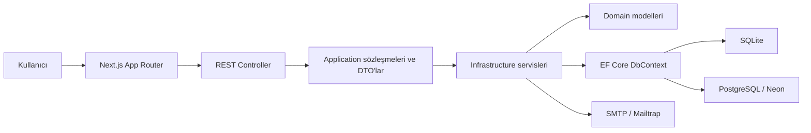

# Sunum Çalışma Rehberi

Bu doküman projeyi yalnızca kullanmayı değil, teknik kararlarını savunabilmeyi amaçlar. Kodun değişmesi hâlinde dosya bağlantıları ve sayısal test sonuçları sunumdan önce yeniden doğrulanmalıdır.

## 1. Otuz Saniyelik Proje Özeti

TechYouth BPM Wizard; topluluk, rol ve takım sınırları içinde dinamik form tasarlamayı, bu formları sürümlenmiş iş akışlarına bağlamayı ve görevleri kişi/takım/rol aday havuzları üzerinden yürütmeyi sağlayan full-stack bir BPM uygulamasıdır. Next.js istemci, .NET 8 REST API, EF Core ve SQLite/PostgreSQL kullanır. İş akışı tanımları görsel editörde hazırlanır ancak çalıştırma kararı frontend'e bırakılmaz; doğrulama, yetkilendirme, durum geçişi, audit ve transaction kuralları backend tarafından uygulanır.

## 2. Mimari Harita

Backend, Clean Architecture yönünden esinlenen hafif bir katmanlı mimaridir:

- **Domain:** İş varlıkları ve enum'lar. Başka proje katmanına bağımlı değildir.
- **Application:** DTO, sonuç modelleri, permission sabitleri ve servis kontratları. Yalnız Domain'e bağımlıdır.
- **Infrastructure:** EF Core, auth, e-posta, workflow runtime, audit ve kontrat implementasyonları.
- **API:** HTTP controller'ları, middleware, cookie/CSRF, rate limit, Swagger ve DI başlangıcı.

Bağımlılık yönü `API -> Application/Infrastructure`, `Infrastructure -> Application/Domain`, `Application -> Domain` şeklindedir. Domain'in Infrastructure'ı tanımaması temel sınırdır. Proje referansları [Application csproj](../apps/api/src/TechYouthBpm.Application/TechYouthBpm.Application.csproj), [Infrastructure csproj](../apps/api/src/TechYouthBpm.Infrastructure/TechYouthBpm.Infrastructure.csproj) ve [API csproj](../apps/api/src/TechYouthBpm.Api/TechYouthBpm.Api.csproj) içinde görülebilir.

## 3. Teknoloji ve Kütüphane Seçimleri

| Teknoloji | Nerede? | Neden? |
| --- | --- | --- |
| Next.js 16 + React 19 | `apps/web` | Native route, shared layout, code splitting ve üretim build'i sağlar. |
| TypeScript 5 | Frontend | API modelleri, form alanları ve graph node'larında tip güvenliği sağlar. |
| Zustand 5 | Session, bildirim cache'i, workflow draft | Redux'a göre daha az törensel; yalnız gerçekten ortak state için kullanılır. |
| `@xyflow/react` | Görsel workflow editörü | Pan/zoom, node/edge ve bağlantı etkileşimini kanıtlanmış bir kütüphaneyle sağlar. |
| `@dnd-kit` | Form alanı/sayfa sıralama | Klavye ve pointer destekli drag/drop; sıralama mantığını elle yazma riskini azaltır. |
| Lucide React | Tüm kullanıcı arayüzü | Tutarlı, erişilebilir ve semantik ikon seti sağlar. |
| .NET 8 / ASP.NET Core | REST API | Güçlü tip sistemi, DI, middleware, async I/O ve test edilebilir HTTP hostu sağlar. |
| EF Core 8 | Persistence | LINQ sorguları, change tracking, transaction ve migrations sağlar. |
| SQLite | Varsayılan local demo | Kurulumsuz, hızlı ve çevrimdışı geliştirme sağlar. |
| PostgreSQL / Npgsql | Ortak/production benzeri ortam | Eşzamanlı kullanım ve uzak takım testi için daha uygundur. |
| Swashbuckle | Swagger/OpenAPI | Endpoint keşfi ve Bearer tabanlı debug akışı sağlar. |
| xUnit + WebApplicationFactory | Backend testleri | Servis kurallarını ve gerçek HTTP/cookie/CSRF davranışını test eder. |
| Vitest | Frontend saf mantık/store testleri | Zustand cache, graph adapter, form modeli ve çeviri parity kontrollerini hızlı çalıştırır. |
| Playwright | Uçtan uca doğrulama | Gerçek API/web sunucusunda cookie session, route guard ve workflow zincirini çalıştırır. |
| GitHub Actions | Otomatik kalite kapısı | Her push'ta test/lint/build; master/manual koşuda E2E, PostgreSQL ve Docker doğrular. |

Sürüm numaralarının güncel kaynağı [package.json](../apps/web/package.json) ve `.csproj` dosyalarıdır.

## 4. Frontend Nasıl Ayrıldı?

Next.js route'ları `apps/web/src/app` altındadır. Authenticated sayfalar [(workspace) layout](<../apps/web/src/app/(workspace)/layout.tsx>) altında ortak sidebar ve topbar kullanır. Route değişirken shell korunur, yalnız `children` değişir; bu hem flashing'i azaltır hem Next.js code splitting avantajını sürdürür.

Ana feature sınırları:

- `features/session`: kullanıcı, token, tema ve dil.
- `features/notifications`: paged cache, optimistic read state ve polling.
- `features/forms`: ortak alan modeli, renderer ve validasyon.
- `features/form-designer`: form/sayfa/alan düzenleme.
- `features/form-runner`: yayınlanmış formu doldurma ve süreç başlatma.
- `features/workflows`: React Flow editörü, graph adapter ve Zustand draft store.
- `features/processes`: süreç, task, claim/action ve geçmiş görünümü.
- `features/management`, `teams`, `settings`: erişim ve hesap yönetimi.

Menü görünürlüğü [navigation.ts](../apps/web/src/features/app-shell/navigation.ts) içindeki permission listeleriyle hesaplanır. Bu yalnız UX filtresidir; gerçek güvenlik backend servislerinde tekrar uygulanır. Frontend'de bir menüyü saklamak tek başına yetkilendirme sayılmaz.

### Neden Her Şey Zustand'da Değil?

Sayfaya özel form state'i ilgili bileşen/hook'ta tutulur. Zustand yalnız route'lar arasında yaşaması gereken session, preferences, notification cache ve workflow draft gibi state'ler için kullanılır. Böylece global store bir “her şey deposu” hâline gelmez.

## 5. Backend Servis Ayrımı

Controller'lar HTTP ayrıntılarıyla ilgilenir; iş kuralları Application kontratlarının Infrastructure implementasyonlarında bulunur. Örnek controller listesi [Controllers](../apps/api/src/TechYouthBpm.Api/Controllers) klasöründedir.

Başlıca sınırlar:

- `IAuthenticationService`: login, refresh ve token'dan aktif kullanıcı çözme.
- `IRegistrationService`: register ve public e-posta doğrulama.
- `IAccountService`: profil, parola ve parola kurtarma.
- `ISessionService`: logout, oturum listeleme ve revoke.
- `IUserAdministrationService`: kullanıcı arama, oluşturma ve admin işlemleri.
- `ICommunityService` / `ICommunityRoleService`: topluluk yaşam döngüsü ve custom roller.
- `ITeamService`: takım ve çoklu takım üyeliği.
- `IFormService` / `IFormVersionService`: form ve immutable sürümler.
- `IProcessDefinitionService`: workflow draft, doğrulama, yayınlama ve sürümleme.
- `IProcessService` / `ITaskService`: runtime süreç ve görev davranışı.
- `IWorkflowVisibilityService`: personal/community/global scope'un tek kaynağı.
- `INotificationService` / `ISystemAuditService`: bildirim ve izlenebilirlik.

Kontratlar [Application/Services](../apps/api/src/TechYouthBpm.Application/Services), implementasyonlar [Infrastructure/Services](../apps/api/src/TechYouthBpm.Infrastructure/Services) altındadır. Kayıtlar [DependencyInjection.cs](../apps/api/src/TechYouthBpm.Infrastructure/DependencyInjection.cs) içinde yapılır.

Identity implementasyonları
[Services/Auth](../apps/api/src/TechYouthBpm.Infrastructure/Services/Auth)
altında fiziksel olarak ayrılmıştır: `AuthenticationService`,
`RegistrationService`, `AccountService`, `SessionService` ve
`UserAdministrationService`. Controller'lar ilgili küçük kontratı doğrudan alır.
[AuthService](../apps/api/src/TechYouthBpm.Infrastructure/Services/AuthService.cs)
ile [IAuthService](../apps/api/src/TechYouthBpm.Application/Services/IAuthService.cs)
production DI'a kayıtlı değildir; eski servis testlerinin davranış uyumluluğunu
koruyan aggregate façade olarak kalır.

### Neden Generic Repository Yok?

EF Core `DbSet` ile repository, `DbContext` ile unit-of-work davranışını zaten sunar. Her entity için `GetAll/Add/Update` sarmalayıcısı eklemek çoğu sorguyu zayıflatır ve gereksiz katman üretirdi. Uygulama sınırı servis kontratlarıyla korunurken persistence işlemleri Infrastructure içindeki [AppDbContext](../apps/api/src/TechYouthBpm.Infrastructure/Data/AppDbContext.cs) üzerinden yapılır.

## 6. Rol, Yetki, Topluluk ve Takım Ayrımı

Bu model dört kavramı ayırır:

1. **Platform rolü:** `SuperAdmin` gibi platform seviyesindeki istisna.
2. **Topluluk:** Veri ve güvenlik izolasyon sınırı.
3. **Community role:** Kullanıcının ne yapabileceğini belirleyen veri tabanlı rol.
4. **Takım:** İşin hangi operasyon grubunda yapıldığını belirleyen üyelik.

Permission adlarının merkezi kaynağı [PermissionNames.cs](../apps/api/src/TechYouthBpm.Application/Auth/PermissionNames.cs) dosyasıdır. Örnekler: `Forms.Create`, `Processes.Start`, `Tasks.Act`, `Teams.Manage`, `Audit.View`.

Aktif session ilk doğrulamada DB'den kullanıcı, community role
permission'ları ve takım üyelikleriyle yüklenir;
[AuthenticatedUserLoader](../apps/api/src/TechYouthBpm.Infrastructure/Services/Auth/AuthenticatedUserLoader.cs)
bu tek canlı çözümleme sınırıdır. [MappingExtensions](../apps/api/src/TechYouthBpm.Infrastructure/Services/MappingExtensions.cs)
SuperAdmin için tüm izinleri, diğer kullanıcılar için aktif community role
izinlerini DTO'ya taşır. Sonuç en fazla 15 saniye `IMemoryCache` içinde tutulur;
logout, rol/topluluk/takım, profil ve şifre mutasyonları ilgili token/user/community
anahtarını anında düşürür. Yetki token'a gömülmez ve cache provider'ı ileride
Redis ile değiştirilebilir.

Süreç/task görünürlüğü [WorkflowVisibilityService](../apps/api/src/TechYouthBpm.Infrastructure/Services/WorkflowVisibilityService.cs) içinde merkezileştirilmiştir:

- `personal`: kullanıcının başlattığı, doğrudan atandığı, claim ettiği veya aday olduğu işler.
- `community`: `Processes.ViewAll` olan kullanıcının kendi topluluğu.
- `global`: yalnız SuperAdmin.

Görev adaylığı [TaskAssignmentResolver](../apps/api/src/TechYouthBpm.Infrastructure/Services/TaskAssignmentResolver.cs) içinde kişi, takım, community role, takım+rol kesişimi ve takım sorumlusu kuralıyla çözülür. Bir takım üyesi görevi görebilir; claim/action için `Tasks.Act`, doğru adaylık ve gerekiyorsa `IsLead` gerekir.

## 7. Authentication ve Session Akışı

Proje JWT kullanmaz; merkezi, opaque session modeli kullanır:

1. Login'de kriptografik olarak rastgele 32 byte token üretilir.
2. Ham token istemciye verilir; DB'de yalnız SHA-256 hash'i saklanır.
3. Protected istekte gelen token hashlenir; kısa ömürlü doğrulama cache'i kontrol edilir.
4. Cache miss durumunda aktif session, kullanıcı durumu, topluluk durumu, permission ve takım üyelikleri DB'den değerlendirilir.
5. Logout, admin revoke veya password reset session'ı merkezi olarak kapatabilir.
6. Güvenlik ve üyelik mutasyonları cache'i anında invalid eder; cache TTL'i `Auth:SessionCacheSeconds` ile ayarlanır.

İlgili kod: [SessionTokenHasher](../apps/api/src/TechYouthBpm.Infrastructure/Security/SessionTokenHasher.cs),
[PasswordHasher](../apps/api/src/TechYouthBpm.Infrastructure/Security/PasswordHasher.cs),
[AuthenticationService](../apps/api/src/TechYouthBpm.Infrastructure/Services/Auth/AuthenticationService.cs)
ve [AuthenticatedUserLoader](../apps/api/src/TechYouthBpm.Infrastructure/Services/Auth/AuthenticatedUserLoader.cs).

Şifreler PBKDF2-SHA256 + kullanıcıya özel salt ile saklanır. Browser cookie akışında `HttpOnly`, `SameSite` ve production'da `Secure` cookie; mutation'larda `X-CSRF-Token` kullanılır. Swagger/dev için Bearer desteği korunur. “Beni hatırla” rotating refresh token üretir; eski refresh token tekrar kullanılırsa reuse şüphesi kabul edilir ve zincir revoke edilir. Login/register/reset endpointlerinde rate limit, kullanıcı bazlı başarısız giriş sayacı ve geçici lockout vardır.

### Neden JWT Değil?

Bu ürünün pending approval, anlık rol değişimi, topluluk pasifleştirme, tüm cihazlardan çıkış ve admin revoke ihtiyacı güçlüdür. Opaque session merkezi revoke kaydını korurken kısa ömürlü ve açık invalidasyonlu cache tekrar eden ilişkisel sorguları azaltır. JWT, kısa ömür/blacklist/refresh katmanlarıyla kurulabilirdi; fakat bu uygulamada tekrar merkezi state ihtiyacı doğuracaktı. Seçim “JWT güvensizdir” değil, ürünün revoke ve dinamik yetki karakterine opaque session'ın daha uygun olmasıdır.

Normal web istemcisi `/api/auth/browser-login` kullanır; API access/refresh sırlarını yalnız HttpOnly cookie'ye koyar ve response body'den çıkarır. `/api/auth/refresh` de yalnız kullanıcı ve süre bilgisini döndürüp cookie'leri rotate eder. Zustand/localStorage yalnız tema ve dil tercihini saklar. Sayfa yenilenince `/api/auth/me` ile kullanıcı toparlanır; access süresi dolmuş remembered session, refresh cookie ile rotate edilir. Swagger ve açık API istemcileri ayrı `/api/auth/login` endpointinden Bearer response almaya devam eder.

Bu ayrımın güvenlik gerekçesi şudur: OWASP, session identifier'larının JavaScript tarafından okunabilen localStorage içinde tutulmamasını önerir. `HttpOnly` access/refresh cookie'leri JavaScript'in token değerini okumasını engeller. CSRF cookie'si ise oturum açma yetkisi taşımaz; frontend'in aynı değeri `X-CSRF-Token` header'ında geri göndermesi ve backend'in cookie-header eşleşmesini doğrulaması için okunabilir kalır. Bu düzen XSS halinde ham token çalınmasını zorlaştırır fakat XSS'yi zararsız yapmaz; output encoding, CSP ve dependency güncelliği hâlâ ayrı savunma katmanlarıdır.

Kaynaklar: [OWASP HTML5 Security](https://cheatsheetseries.owasp.org/cheatsheets/HTML5_Security_Cheat_Sheet.html), [OWASP CSRF Prevention](https://cheatsheetseries.owasp.org/cheatsheets/Cross-Site_Request_Forgery_Prevention_Cheat_Sheet.html), [MDN Set-Cookie](https://developer.mozilla.org/en-US/docs/Web/HTTP/Reference/Headers/Set-Cookie).

## 8. Dinamik Form Yaşam Döngüsü

1. Form Designer alan, sayfa, sıra ve validasyon modelini oluşturur.
2. `@dnd-kit`, sayfa içi ve sayfalar arası sıralamayı yönetir.
3. Draft değiştirilebilir; published sürüm immutable'dır.
4. Yeni düzenleme yeni version üretir; çalışan süreç eski version'a pinli kalır.
5. Frontend kullanıcı deneyimi için doğrular; backend güvenlik/veri bütünlüğü için aynı kuralları tekrar doğrular.
6. Start Event başlangıç form version'ına, User Task ise opsiyonel task form version'ına bağlanır.

Ana kodlar: [FormDesignerDraft](../apps/web/src/features/form-designer/FormDesignerDraft.tsx), [FormRunnerDraft](../apps/web/src/features/form-runner/FormRunnerDraft.tsx), [FormService](../apps/api/src/TechYouthBpm.Infrastructure/Services/FormService.cs), [FormVersionService](../apps/api/src/TechYouthBpm.Infrastructure/Services/FormVersionService.cs).

Dosya alanı bugün gerçek binary storage değildir; dosya adı, türü ve benzeri metadata saklar. Bu bilinçli demo sınırıdır. Production'da object storage, boyut/MIME kontrolü, zararlı içerik taraması ve signed URL gerekir.

## 9. Dinamik Workflow Nasıl Çalışır?

Frontend'deki React Flow yalnız editör motorudur. [apiGraphAdapter](../apps/web/src/features/workflows/apiGraphAdapter.ts), kütüphaneye özgü görsel state'i provider-neutral `ProcessGraphDto` sözleşmesine çevirir. Böylece backend `@xyflow/react` bilmez.

Yayınlama ve runtime zinciri:

1. Start, User Task, Gateway, End ve Swimlane node'ları graph olarak hazırlanır.
2. [ProcessGraphValidator](../apps/api/src/TechYouthBpm.Infrastructure/Services/ProcessGraphValidator.cs) erişilemeyen node, eksik assignment, yayınlanmamış form, belirsiz edge, cross-community hedef ve unsafe cycle hatalarını reddeder.
3. Published graph JSON immutable version olarak saklanır.
4. Süreç başlatılırken process instance bu version'a pinlenir.
5. [DynamicWorkflowEngine](../apps/api/src/TechYouthBpm.Infrastructure/Services/DynamicWorkflowEngine.cs) Start'tan ilerler, gateway koşullarını typed operatörlerle değerlendirir ve User Task oluşturur.
6. Aday kullanıcılar assignment resolver ile bulunur; bildirimler oluşturulur.
7. Aday havuzundaki kullanıcı işi claim eder. Eşzamanlı claim'de yalnız bir kullanıcı kazanır.
8. Task formu backend'de doğrulanır; çıktı `steps.<nodeKey>` altında process variables'a yazılır.
9. `Approve`, `Reject`, `Complete`, `SendBack` veya `Escalate` edge'i takip edilir.
10. Yeni task üretilir veya Completed/Rejected End süreci bitirir.

[ProcessStateMachine](../apps/api/src/TechYouthBpm.Application/Workflow/ProcessStateMachine.cs) üst seviye yaşam döngüsünü, DynamicWorkflowEngine graph ilerlemesini yönetir. Süreç, task, step execution, notification ve audit aynı transaction sınırında yazılır; ara adım hata verirse yarım süreç bırakılmaz.

## 10. Audit, Bildirim ve İzlenebilirlik

İki seviye iz vardır:

- **Process audit / step execution:** Bir süreçte hangi node'a ne zaman girildi, task'ı kim claim/tamamladı, hangi action ile nereye gidildi?
- **System audit:** Login, kullanıcı/rol/takım/topluluk/form/workflow/process/task gibi sistem olayları kim tarafından hangi entity üzerinde yapıldı?

Kategori eşlemesi [SystemAuditCategories](../apps/api/src/TechYouthBpm.Application/Audit/SystemAuditCategories.cs), sorgu/yazma [SystemAuditService](../apps/api/src/TechYouthBpm.Infrastructure/Services/SystemAuditService.cs) içindedir. Audit kayıtları community scope taşır; Topluluk Admin kendi sınırını, SuperAdmin global geçmişi görür.

Bildirimler DB tabanlıdır. Topbar son kayıtları polling ile alır; Gelen Kutusu server-side pagination, arama ve kategori filtresi kullanır. [notificationStore](../apps/web/src/features/notifications/notificationStore.ts) 30 saniyelik stale-while-revalidate cache ve optimistic okundu/okunmadı değişikliği uygular. WebSocket/SSE henüz yoktur; polling bilinçli v1 tercihidir.

## 11. Veritabanı ve Migration Kararı

Schema `EnsureCreated` ile değil EF Core migrations ile yönetilir. API açılışında migrations uygulanır, ardından deterministic/idempotent seed çalışır. Sağlayıcı seçimi Infrastructure içinde konfigürasyonla yapılır:

- Local varsayılan: SQLite.
- Ortak/production benzeri: PostgreSQL veya Neon.

Controller, DTO ve workflow kuralları provider değişince değişmez. Tasarım zamanı context üretimi [AppDbContextFactory](../apps/api/src/TechYouthBpm.Infrastructure/Data/AppDbContextFactory.cs), model ve indexler [AppDbContext](../apps/api/src/TechYouthBpm.Infrastructure/Data/AppDbContext.cs), migration geçmişi [Migrations](../apps/api/src/TechYouthBpm.Infrastructure/Data/Migrations) altındadır.

## 12. Test Stratejisi

Test piramidi saf kurallar, relational SQLite servisleri,
`WebApplicationFactory` HTTP güvenlik/yetki akışları, OpenAPI/query regresyonları,
opt-in PostgreSQL migration smoke, frontend Vitest ve Playwright E2E'den oluşur.

Güncel sayılar, kapsam kataloğu ve komutlar tek yerde tutulur:
[Testing And Quality Gates](24-testing-and-quality-gates.md). Sunumdan önce
oradaki komutları yeniden çalıştırın; manuel Transfer zinciri için
[Workflow Uçtan Uca Test Senaryoları](22-workflow-end-to-end-test-scenarios.md)
belgesini izleyin.

## 13. Uçtan Uca Örnek Anlatım

“Transfer Talep Akışı” üzerinden:

1. Form Tasarımcısı çok sayfalı transfer formunu yayınlar.
2. Workflow Tasarımcısı başlangıç formunu Start node'una bağlar.
3. Scout, teknik değerlendirme, bütçe gateway'i ve transfer operasyon task'ları takım/role atanır.
4. Kullanıcı yayınlanmış formu doldurur; backend formu doğrular ve pinned process version ile instance oluşturur.
5. İlk aday takıma bildirim gider; uygun kişi görevi claim eder.
6. Task formu doldurulup action verilir. Fiyat eşiği gateway koşulunu belirler.
7. Mali onay gerekiyorsa yalnız doğru takım/rol, gerekiyorsa takım sorumlusu hareket edebilir.
8. Her değişiklik transaction içinde process variables, step execution, audit ve notification üretir.
9. Süreç detayından aktör, tarih, node, form çıktısı ve geçiş zinciri görülebilir.

Bu anlatım dinamik form, versioning, authorization, workflow runtime, takım adaylığı, bildirim ve audit özelliklerini tek senaryoda gösterir.

## 14. Sık Sorulabilecek Sorular ve Kısa Cevaplar

### “Burada Next.js mi kullandınız, neden?”

Evet. App Router, native route ve code splitting kullanıyoruz. `(workspace)/layout.tsx` sidebar/topbarı geçişlerde koruyor; her page yalnız kendi feature view'ını import ediyor.

### “Zustand neden seçildi?”

Session, preferences, notification cache ve workflow draft gibi route'lar arası state için küçük ve tip güvenli bir API sağlıyor. Sayfaya özel state'i globalleştirmiyoruz.

### “Controller-Service-Repository yapınız var mı?”

Controller ve service sınırları var. Repository davranışını EF Core `DbContext/DbSet` sağladığı için sırf isim olarak generic repository eklemedik. Mimari API, Application, Domain, Infrastructure katmanlarından oluşan pragmatic layered/Clean-influenced yapıdır.

### “Rol kontrolü kodda nerede?”

Permission kataloğu `PermissionNames.cs`; aktif permission çözümü
`AuthenticatedUserLoader` + `MappingExtensions`; menü filtresi `navigation.ts`;
süreç/task scope'u `WorkflowVisibilityService`; adaylık ve takım sorumlusu kuralı
`TaskAssignmentResolver` içindedir. Kritik karar backend'dedir.

### “Kullanıcıya rol verince tekrar login gerekli mi?”

Hayır. Opaque token yalnız session kimliğidir. Rol/takım değişikliği cache'i invalid eder; sonraki protected istek güncel kullanıcı bağlamını sunucudan çözer. Revoke gerekirse session merkezi olarak kapatılır.

### “JWT neden kullanılmadı?”

Dinamik rol, pending approval, topluluk pasifleştirme ve cihaz revoke ihtiyaçları merkezi state gerektiriyor. Opaque session bu ürün için daha doğrudan; JWT de kurulabilirdi ancak blacklist/çok kısa access token/refresh ile tekrar merkezi kontrol gerektirecekti.

### “Camunda kullandınız mı?”

Hayır. Camunda/Kissflow ürün ve UX referansıdır. Proje kapsamına uygun typed JSON graph, validator ve özel .NET runtime geliştirdik. Full BPMN XML/import/export veya Camunda deployment iddiasında bulunmuyoruz.

### “React Flow business logic çalıştırıyor mu?”

Hayır. Yalnız canvas etkileşimini sağlar. Graph DTO backend'e gider; yayınlama ve çalışma kuralları backend validator/runtime tarafından uygulanır.

### “Form ve workflow sürümleme neden önemli?”

Yayınlanmış tanım sonradan değiştirilirse çalışan sürecin anlamı bozulur. Bu yüzden published version immutable ve process instance başladığı version'a pinlidir.

### “Topluluk, rol ve takım niye ayrı?”

Topluluk güvenlik/veri sınırı, rol yapılabilecek işlemler, takım ise işin operasyonel aday grubudur. “Scout Ekibi” takım, “Scout Sorumlusu” roldür.

### “İşlem yarıda kalırsa ne olur?”

Kritik process/task/form yazmaları transaction sınırındadır. Task oluşup audit oluşamazsa transaction rollback olur; yarım kayıt bırakılmaz.

### “Health endpointleri katmanlı mimariye nasıl uyuyor?”

`ISystemReadinessService` ve nötr rapor modeli Application'dadır. EF Core ile
bağlantı, pending migration ve tam bir aktif SuperAdmin kontrolünü Infrastructure
yapar. API yalnız `/health/live` ve `/health/ready` endpointlerini map eder.
Domain/Application ayrı proses olmadığı için yapay “katman ayakta mı?” kontrolü
yoktur.

### “Neden Serilog, Sentry veya Datadog eklemediniz?”

Bugün built-in `ILogger` ve production JSON console formatter ile correlation
ID'li teknik log üretiyoruz; iş olayları ayrı `SystemAuditLog`'da kalıyor.
Serilog/Sentry/Seq/OpenTelemetry bir hedef değil taşıma aracıdır. Gerçek hosting,
retention, erişim ve maliyet kararı olmadan vendor bağımlılığı eklemek yerine,
standart JSON çıktısını seçilecek platforma bağlamayı bilinçli sonraki adım
olarak bıraktık.

### “GitHub Actions PR olmadan ne işe yarıyor?”

Workflow her push'ta test/lint/build çalışır; `master` veya manuel koşuda
Playwright, PostgreSQL migration ve Docker doğrulaması da eklenir. PR zorunlu
değildir ve otomatik deployment yapılmaz. Ama ekip doğrudan push etse bile bozuk
commit merkezi olarak görünür ve aynı branch'in eski koşusu iptal edilir.

### “Sistem ne kadar production-ready?”

Migrations, PostgreSQL desteği, hashing, cookie-only browser transport, revoke,
CSRF, rate limit, lockout, permission scope, audit, transaction, health,
ProblemDetails, güvenli JSON logları, integration testleri, Playwright ve CI
güçlü temeldir. Kalan başlıca production işleri: gerçek object
storage/antivirus, secret manager, backup/restore, hostinge bağlanmış
observability/error tracking ve gelişmiş BPM node'larıdır.

## 15. Sunum Akışı Önerisi

1. Problemi ve aktörleri anlatın: SuperAdmin, Topluluk Admin, form tasarımcısı, süreç başlatıcı, görev adayı.
2. Mimari diyagram ve dependency rule'u gösterin.
3. Topluluk-role-team ayrımını gerçek kullanıcı üzerinden gösterin.
4. Form oluşturup yayınlayın.
5. Workflow'a form ve assignment bağlayın, validate/publish edin.
6. Süreci başlatın; başka kullanıcıyla claim ve action yapın.
7. Bildirim, süreç geçmişi ve system audit zincirini gösterin.
8. Test komutlarını ve PostgreSQL migration desteğini gösterin.
9. Bilinçli sınırları dürüstçe söyleyin; gelecekteki genişleme noktalarını açıklayın.

## 16. Kod Okuma Rotası

Projeyi hızlı öğrenmek için şu sırayı izleyin:

1. [README](../README.md) ve [Quick Start](../QUICKSTART.md)
2. [Program.cs](../apps/api/src/TechYouthBpm.Api/Program.cs) ve [DependencyInjection.cs](../apps/api/src/TechYouthBpm.Infrastructure/DependencyInjection.cs)
3. [PermissionNames.cs](../apps/api/src/TechYouthBpm.Application/Auth/PermissionNames.cs)
4. [AuthenticationService](../apps/api/src/TechYouthBpm.Infrastructure/Services/Auth/AuthenticationService.cs),
   [AuthenticatedUserLoader](../apps/api/src/TechYouthBpm.Infrastructure/Services/Auth/AuthenticatedUserLoader.cs)
   ve [WorkflowVisibilityService](../apps/api/src/TechYouthBpm.Infrastructure/Services/WorkflowVisibilityService.cs)
5. [ProcessGraphValidator](../apps/api/src/TechYouthBpm.Infrastructure/Services/ProcessGraphValidator.cs) ve [DynamicWorkflowEngine](../apps/api/src/TechYouthBpm.Infrastructure/Services/DynamicWorkflowEngine.cs)
6. [(workspace) layout](<../apps/web/src/app/(workspace)/layout.tsx>), [navigation.ts](../apps/web/src/features/app-shell/navigation.ts) ve [sessionStore](../apps/web/src/features/session/sessionStore.ts)
7. [workflowDraftStore](../apps/web/src/features/workflows/workflowDraftStore.ts) ve [apiGraphAdapter](../apps/web/src/features/workflows/apiGraphAdapter.ts)
8. [Uçtan uca workflow senaryoları](22-workflow-end-to-end-test-scenarios.md)

Bu sıra önce sistemi, sonra güvenlik sınırını, ardından dinamik BPM davranışını öğretir.
